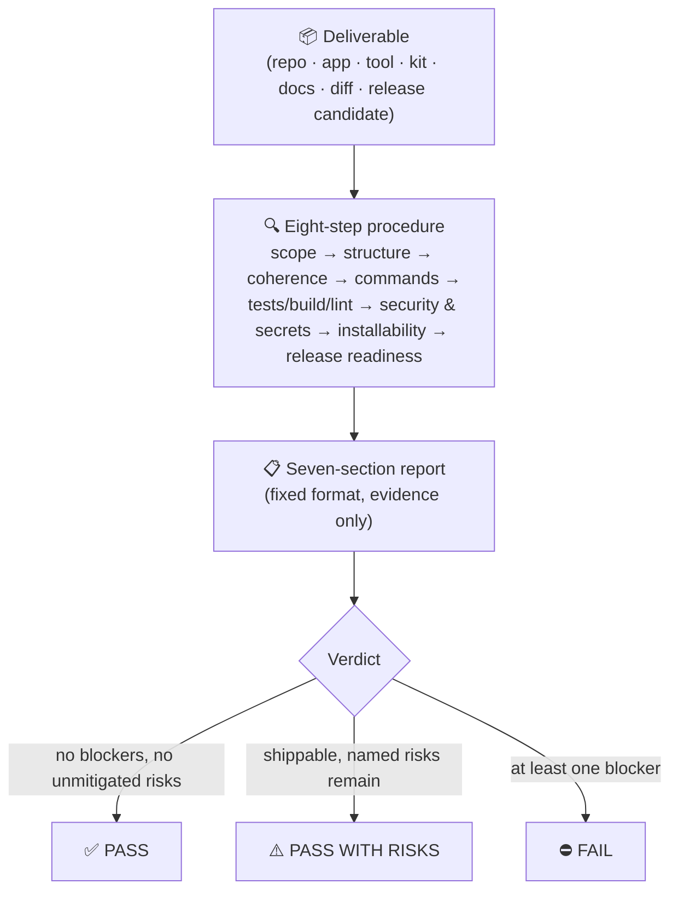

<div align="center">

# 🛡️ Final Review Skill

**The last gate before you call it done.**

A strict, final-gate review skill for AI agents — one fixed procedure, one fixed report, three possible verdicts.

[](https://github.com/Tire-C/final-review-skill/actions/workflows/ci.yml)
[](LICENSE)
[](skills/final-review/SKILL.md)
[](CHANGELOG.md)
[](CONTRIBUTING.md)

`PASS` &nbsp;·&nbsp; `PASS WITH RISKS` &nbsp;·&nbsp; `FAIL`

</div>

---

## Table of contents

- [The problem](#the-problem)
- [What it is](#what-it-is)
- [How it works](#how-it-works)
- [At a glance](#at-a-glance)
- [What it checks](#what-it-checks)
- [The verdicts](#the-verdicts)
- [Quick start](#quick-start)
- [Usage](#usage)
- [The report contract](#the-report-contract)
- [Example output](#example-output)
- [Use cases](#use-cases)
- [Repository structure](#repository-structure)
- [Compatibility](#compatibility)
- [Customization](#customization)
- [Validation & CI](#validation--ci)
- [FAQ](#faq)
- [Security notes](#security-notes)
- [Contributing](#contributing)
- [License](#license)

## The problem

Every deliverable reaches a moment where someone has to say *"this is done"* — and most of the time that decision is made on gut feeling. The README wasn't re-read after the last refactor. The install command was never tried on a clean machine. A `.env` slipped into the history three commits ago. Nobody checked whether the changelog matches the tag.

"Looks good to me" is not a release process.

## What it is

**Final Review** turns that last look into a repeatable procedure. It is an [Agent Skill](skills/final-review/SKILL.md) — a single markdown file that instructs your AI agent to act as a strict technical supervisor signing off a release:

- it follows the **same eight steps** every time,
- it reports in the **same seven sections** every time,
- it ends with **one of three verdicts** every time,
- and it **never touches your files** — it reviews, you decide.

No dependencies, no runtime, no network access. Install it once and every "is this ready?" becomes a structured answer instead of a shrug.

## How it works



The agent gathers evidence (files, diffs, command output), refuses assumptions, and maps everything it finds into the fixed report. Missing tests or missing docs are findings, not excuses to stop.

## At a glance

| | |
|---|---|
| **Type** | Agent Skill (`SKILL.md` with YAML frontmatter) |
| **Skill name** | `final-review` |
| **Works on** | repositories, apps, CLI tools, libraries, kits/templates, documentation sets, workflows, diffs/PRs, release candidates |
| **Output** | fixed seven-section report + verdict |
| **Verdicts** | `PASS` · `PASS WITH RISKS` · `FAIL` |
| **Side effects** | none — read-only by contract |
| **Dependencies** | none |
| **Install** | copy one directory (scripts provided for Windows and Unix) |
| **License** | [MIT](LICENSE) |
| **CI** | structure, frontmatter, secret-pattern and link validation on every push/PR |

## What it checks

| # | Area | What the agent verifies |
|---|------|-------------------------|
| 1 | **Scope** | what the deliverable is and what "done" means for it |
| 2 | **Structure & completeness** | expected files present; no leftovers, artifacts, or dead code |
| 3 | **Coherence** | code, config, and docs agree on names, versions, paths, behavior |
| 4 | **Documented commands** | install/build/run/test instructions actually work as written |
| 5 | **Tests, build, lint** | everything available is run; whatever is missing is flagged |
| 6 | **Security & secrets** | hardcoded keys, tokens, credentials, private paths, risky patterns |
| 7 | **Installation & usability** | a newcomer can install and use it from the docs alone |
| 8 | **Release readiness** | versioning, changelog, license, blocking TODO/FIXME |

## The verdicts

| Verdict | Meaning | What you do next |
|---------|---------|------------------|
| ✅ `PASS` | Ready to ship. No blocking issues, no unmitigated risks. | Ship it. |
| ⚠️ `PASS WITH RISKS` | Shippable, but named risks remain — each listed with its concrete impact. | Read the risks, accept or fix, own the decision. |
| ⛔ `FAIL` | Not shippable. At least one blocking problem. | Section 7 is your work list. Fix, re-review. |

`PASS WITH RISKS` is the honest middle ground: not a polite `FAIL`, not a lazy `PASS`. Every accepted risk is written down, so shipping is an informed decision — made by a human, not by momentum.

## Quick start

Clone this repository, then from its root:

**Windows (PowerShell)**

```powershell
.\install.ps1                  # personal skill -> ~/.claude/skills/final-review
.\install.ps1 -Target project  # project skill  -> ./.claude/skills/final-review
```

**macOS / Linux**

```sh
./install.sh            # personal skill -> ~/.claude/skills/final-review
./install.sh project    # project skill  -> ./.claude/skills/final-review
```

**Manual — any Agent Skills client**

```
copy skills/final-review/  ->  <your client's skills directory>/final-review/
```

That's the whole installation: one directory, one file. Details, custom destinations, update and uninstall: [docs/installation.md](docs/installation.md).

## Usage

Ask for a final check in natural language — the agent picks the skill up from its description:

> Run a final review of this repository before I tag v1.0.0.

> Final review of the docs folder — is it ready to publish?

> I think this feature is done. Give me the release verdict.

In Claude Code you can also invoke it explicitly:

```
/final-review
```

Scope it like you would brief a human reviewer: *the whole repo*, *the current diff against main*, *only the installer and the docs*. The sharper the scope, the sharper the report. More patterns and tips: [docs/usage.md](docs/usage.md).

## The report contract

Every review returns exactly this structure — no more, no less:

```
## Final Review

1. What was reviewed / what changed
2. Files and structure
3. Matches the request/spec: yes/no + gaps
4. Checks run (tests, build, lint, commands) + results
5. Security & secrets findings
6. Risks left
7. Fixes required before release

Verdict: PASS | PASS WITH RISKS | FAIL
```

Because the format never changes, you can compare reviews across time, diff them between release candidates, or parse them in automation.

## Example output

```
## Final Review

1. What was reviewed: csvlint v2.1.0 release candidate (full repository)
2. Files and structure: complete; src/, tests/, docs/ consistent with README
3. Matches the request/spec: yes
4. Checks run: pytest (41 passed), ruff (clean), pip install -e . (ok)
5. Security & secrets: no findings
6. Risks left: none
7. Fixes required before release: none

Verdict: PASS
```

Full-length, realistic reports for all three verdicts:

- ✅ [examples/pass.md](examples/pass.md) — a Python CLI ready to tag
- ⚠️ [examples/pass-with-risks.md](examples/pass-with-risks.md) — a client delivery with four named risks
- ⛔ [examples/fail.md](examples/fail.md) — a starter kit blocked by a committed secret and a broken setup script

## Use cases

- **Release gate** — before tagging a version or publishing a package
- **Handover gate** — before delivering a project, kit, or tool to a client or another team
- **Merge gate** — before merging a large change or closing a milestone
- **Agent verification** — one agent session does the work, a *fresh* session runs the final review; a reviewer without the builder's assumptions is stricter
- **Documentation shipping** — docs sets and templates are deliverables too, and they fail reviews just as often as code
- **Archive gate** — before declaring anything "complete" and walking away

## Repository structure

```
final-review-skill/
├── skills/
│   └── final-review/
│       └── SKILL.md               # ← the skill (this is what gets installed)
├── install.ps1                    # one-command install, Windows
├── install.sh                     # one-command install, Unix/macOS/Linux
├── scripts/
│   ├── validate.sh                # structure/frontmatter/secret/link validation (CI)
│   └── validate.ps1               # same checks, native PowerShell
├── examples/
│   ├── pass.md                    # realistic PASS report
│   ├── pass-with-risks.md         # realistic PASS WITH RISKS report
│   └── fail.md                    # realistic FAIL report
├── docs/
│   ├── installation.md            # all install paths, verify, update, uninstall
│   ├── usage.md                   # invocation, scoping, acting on verdicts
│   ├── customization.md           # what to adapt, what to keep stable
│   └── philosophy.md              # five operating principles
├── .github/workflows/ci.yml      # runs scripts/validate.sh on every push/PR
├── CHANGELOG.md · CONTRIBUTING.md · CODE_OF_CONDUCT.md · SECURITY.md · LICENSE
└── README.md                      # you are here
```

## Compatibility

| Client | Install location | Status |
|--------|-----------------|--------|
| **Claude Code** — personal skill | `~/.claude/skills/final-review/` | ✅ supported |
| **Claude Code** — project skill | `.claude/skills/final-review/` | ✅ supported |
| **Any Agent Skills-compatible agent** | the client's skills directory | ✅ supported |

The skill is a single self-contained `SKILL.md` with standard frontmatter (`name`, `description`). If your client can load Agent Skills, it can load this one — there is nothing else to resolve.

## Customization

The skill is designed to be forked and tightened. Safe to change: add domain-specific checks, harden verdict rules ("missing tests is always FAIL"), set the report language, bake in a project's exact build commands. Keep stable: the seven sections, the three verdicts, and the read-only rule — they are the public contract that makes reviews comparable.

Full guidance: [docs/customization.md](docs/customization.md) · Design rationale: [docs/philosophy.md](docs/philosophy.md)

## Validation & CI

Every push and pull request runs [`scripts/validate.sh`](scripts/validate.sh), which checks:

- all required files are present,
- `SKILL.md` has well-formed frontmatter (`name: final-review`, non-empty `description` ≤ 1024 chars),
- no secret-shaped strings anywhere in the repository,
- every relative markdown link resolves.

Run the same checks locally before a PR:

```sh
bash scripts/validate.sh          # Unix/macOS/Linux
```

```powershell
pwsh -File scripts/validate.ps1   # Windows
```

## FAQ

<details>
<summary><strong>Does it modify my files?</strong></summary>

No — by contract. The skill's first rule is *"do not modify files unless explicitly requested."* Reviewing and fixing are separate jobs: read the report, then ask for fixes if you want them, then re-review.
</details>

<details>
<summary><strong>Does it need dependencies, a runtime, or network access?</strong></summary>

No. The skill is one markdown file interpreted by your agent. The only executables in this repository are the install scripts (which copy a directory) and the validation scripts (which read files).
</details>

<details>
<summary><strong>Can it review things that aren't code?</strong></summary>

Yes. Documentation sets, kits, templates, and workflows are deliverables with structure, coherence, usability, and release readiness — the procedure applies to all of them. Steps that don't apply (e.g. "run tests" on a docs folder) are skipped *and declared as skipped* in the report.
</details>

<details>
<summary><strong>How is this different from a normal code review?</strong></summary>

A code review is a conversation during the work. Final Review is a **gate at the end** of the work: it runs once, on the finished candidate, and produces a verdict. Use both — they answer different questions.
</details>

<details>
<summary><strong>Why three verdicts instead of a score?</strong></summary>

Scores invite negotiation ("7.5 is basically an 8"). A gate needs a decision: ship, ship-with-eyes-open, or fix. `PASS WITH RISKS` exists precisely so real-world trade-offs are written down instead of hidden inside a number.
</details>

<details>
<summary><strong>Can I make it stricter?</strong></summary>

Yes — that is the intended way to customize it. Add checks, promote risks to blockers, require specific tools to run. See [docs/customization.md](docs/customization.md). Just keep the report format and the verdict names stable.
</details>

<details>
<summary><strong>Which agents support it?</strong></summary>

Claude Code out of the box (personal or project skill), and any client implementing the Agent Skills format — the skill uses only the standard `name` + `description` frontmatter, nothing vendor-specific.
</details>

## Security notes

- The skill is **plain markdown** — it executes nothing by itself.
- It instructs the agent to *review*, never to modify, delete, or publish anything.
- The install and validation scripts only copy and read files; review them before running, as with any script from the internet.
- The skill's own checklist hunts for committed secrets and API keys in whatever it reviews — and this repository's CI applies the same standard to itself.
- Found a vulnerability? Please use private reporting: see [SECURITY.md](SECURITY.md).

## Contributing

Issues and pull requests are welcome. Read [CONTRIBUTING.md](CONTRIBUTING.md) first — the short version: keep the skill universal, keep it terse, run `scripts/validate.sh` before pushing, and treat the report format as a public contract. Community standards: [CODE_OF_CONDUCT.md](CODE_OF_CONDUCT.md).

Versioning follows [SemVer](https://semver.org/spec/v2.0.0.html); history lives in [CHANGELOG.md](CHANGELOG.md).

## License

[MIT](LICENSE) — use it, fork it, ship it.

---

<div align="center">

**If Final Review saved you from shipping a broken release, a ⭐ is appreciated.**

*Built to be the last thing that runs before "done".*

</div>
